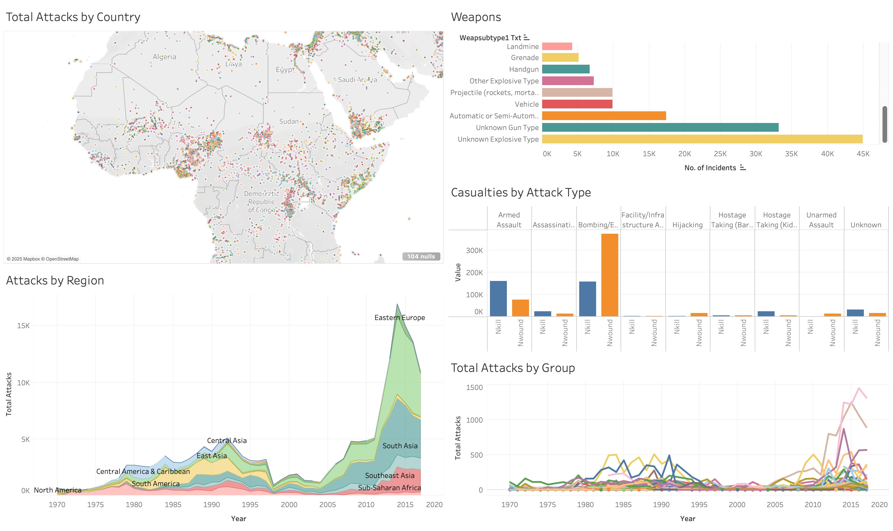

# 📊 Project Title: **Global Terrorism Analysis: Big Data Insights using PySpark and Tableau**

## Overview

This project investigates trends in terrorism using the [Global Terrorism Database](https://www.start.umd.edu/data-tools/GTD) (GTD), a large open-source database made available by the University of Maryland. The GTD contains information on over 200,000 incidents of terrorism from the 1970s through 2020. 

This project investigates global terrorism trends using comprehensive big data analytics and interactive visualization tools. Utilizing the Global Terrorism Database (GTD)—the most extensive open-source collection of global terrorist incident data—this analysis identifies patterns, geographic hotspots, and strategic insights, aiding policymakers, analysts, and researchers in counterterrorism efforts.

Please note that due to its large size, the raw data file must be downloaded from Kaggle using this link: https://www.kaggle.com/datasets/START-UMD/gtd.

---

## 📁 Project Structure

```
Big_Data_Analysis_Visualization-Global_Terrorism_Dataset-7153CEM/
│
├── Big_Data_Analysis_and_Data_Visualization.ipynb  # Jupyter Notebook for PySpark analysis and visualization
├── globalterrorismdb_0718dist.csv                  # Raw Global Terrorism Dataset (Must be separately downloaded from Kaggle)
├── choropleth_attacks_by_country.html              # Interactive choropleth map showing attacks by country
├── choropleth_fatalities_by_country.html           # Interactive choropleth map showing fatalities by country
├── global_terrorism_clusters.html                  # HTML visualization of terrorism clusters
├── heatmap_attacks.html                            # Interactive heatmap visualization of terrorist attacks
├── map_by_target_type.html                         # Interactive map categorized by attack target types
├── terrorism_clusters_map.html                     # Interactive map visualizing clusters of terrorist activity
├── terrorism_map.html                              # Interactive global map visualizing terrorist attacks
├── Visualizations.twbx                             # Tableau dashboard file
├── README.md                                       # Project overview and setup instructions
└── requirements.txt                                # Python dependencies required for the project
```

---

## 📑 Dataset Metadata

**Context:**

* Data on over 200,000 terrorist attacks globally.
* Maintained by the National Consortium for the Study of Terrorism and Responses to Terrorism (START) at the University of Maryland.

**Content:**

* **Geography:** Worldwide
* **Time Period:** 1970–2020 
* **Unit of Analysis:** Individual terrorist attacks
* **Variables:** Over 100 detailed variables, including location, attack type, perpetrators, targets, and outcomes
* **Data Sources:** Primarily unclassified media reports

**Key Metadata Fields:**

| Field Name        | Description                                     | Data Type |
| ----------------- | ----------------------------------------------- | --------- |
| `eventid`         | Unique identifier for each terrorist incident.  | Integer   |
| `iyear`           | Year of the incident.                           | Integer   |
| `imonth`          | Month of the incident.                          | Integer   |
| `iday`            | Day of the incident.                            | Integer   |
| `country`         | Country where the incident occurred.            | String    |
| `country_txt`     | Full country name.                              | String    |
| `region`          | Region where the incident occurred.             | Integer   |
| `region_txt`      | Full region name.                               | String    |
| `provstate`       | Province or state where the incident occurred.  | String    |
| `city`            | City where the incident occurred.               | String    |
| `latitude`        | Latitude of the incident location.              | Float     |
| `longitude`       | Longitude of the incident location.             | Float     |
| `attacktype1`     | Primary type of attack (coded as integer).      | Integer   |
| `attacktype1_txt` | Description of the primary attack type.         | String    |
| `targtype1`       | Primary target type (coded as integer).         | Integer   |
| `targtype1_txt`   | Description of the primary target type.         | String    |
| `gname`           | Name of the perpetrator group, if known.        | String    |
| `nkill`           | Number of fatalities (victims) in the incident. | Float     |
| `nwound`          | Number of non-fatal injuries in the incident.   | Float     |
| `weaptype1`       | Primary weapon type (coded as integer).         | Integer   |
| `weaptype1_txt`   | Description of the primary weapon type.         | String    |
| `summary`         | Brief summary description of the incident.      | String    |


---
**⚠️ Note:** The GTD includes many additional fields beyond those listed above, including information on motives, specific attack and target details, property damage, and hostages.

## 🔧 Setup and Installation Instructions


**⚠️ Note:** These steps must be executed on the server to ensure proper setup and functionality.

### Step 1: Connect to the Server

Use the following command to connect to the server:

```bash
ssh -i /path/to/private_key username@your.azure.server.ip
```

Once connected, proceed with the setup steps below.

### Optional: Simplified Setup with `run.sh`

You can skip Steps 2, 3, and 4 by using the provided `run.sh` script.

#### Step 1: Grant Execution Permission

Before running the script, provide execution privileges:

```bash
chmod +x run.sh
```

#### Step 2: Execute the Script

Run the script to automatically set up the environment and install dependencies:

```bash
./run.sh
```

This will streamline the setup process and prepare the project for use.

### Step 2: Setup Virtual Environment

Create and activate a virtual environment:

```bash
python -m venv .venv
source .venv/bin/activate   # Windows: .venv\Scripts\activate
```

### Step 3: Install Dependencies

Install necessary Python packages:

```bash
pip install -r requirements.txt
```

Also download the csv file from the GTD dataset on Kaggle: https://www.kaggle.com/datasets/START-UMD/gtd and save it to your working directory.

### Step 4: Launch Jupyter Notebook on Azure

Run Jupyter Notebook remotely on Azure cloud:

```bash
jupyter notebook --no-browser --ip=0.0.0.0 --port=8888
```

### Step 5: Access Jupyter Notebook from Local Machine

After running the above command, you will see a token in your terminal output:

```plaintext
http://127.0.0.1:8888/?token=your_generated_token_here
```

**Copy this token for authentication.**

Then, establish SSH port forwarding from your local machine using:

```bash
ssh -i /path/to/private_key -L 8888:localhost:8888 username@your.azure.server.ip
```
**💡 Note:** If you encounter an error indicating that port `8888` is not open, replace `8888` with another value between `8880-8898` in both the `jupyter notebook` command and the SSH port forwarding command.

Open your local browser and navigate to:

```plaintext
http://127.0.0.1:8888
```
Enter the copied token to authenticate and access Jupyter Notebook.

OR

```plaintext 
 http://127.0.0.1:8888/?token=your_generated_token_here
 ```

Open `Big_Data_Analysis_and_Data_Visualization.ipynb` to start analyzing the dataset and run the cells.

### Step 6: Tableau Installation and Usage

* **Download Tableau Public:**

Visit [Tableau Public Download](https://public.tableau.com/en-us/s/download) and download Tableau Public.

* **Setup:**

  * Install Tableau Public on your local machine.
  * Open Tableau Public.
  * Load the provided `Visualizations.twbx` file from the downloaded project.

---

## 📈 Step-by-Step Guide

### Step 1:

Run `Big_Data_Analysis_and_Data_Visualization.ipynb` within Jupyter Notebook for detailed data analysis and generating visualizations.

### Step 2:

View the interactive `.html` files directly in your local browser for further insights. (Note: Once the files are open, you must click 'Trust HTML' to load each image.)

### Step 3:

Open `Visualizations.twbx` in Tableau Public to explore interactive dashboards providing comprehensive insights into terrorism trends.

---

## 📊 Analysis Insights

## 🖥️ Interactive Dashboard

Below is a screenshot of the Tableau dashboard, which gives breaks down attacks based on their target region, attack type, perpetrating group, and choice of weapons. It allows users to easily identify geographic locations that are hotspots for terrorist attacks, which can allow policymakers to optimize their protection efforts to the right areas. 



## 📓 Executive Summary

* **Interactive HTML Visualizations** provide geographic, temporal, and categorical insights.
* **Tableau Dashboard** enables in-depth analytical exploration of terrorism data.
* Interpret analytical insights detailed in visualizations and Tableau dashboard for comprehensive strategic understanding.

